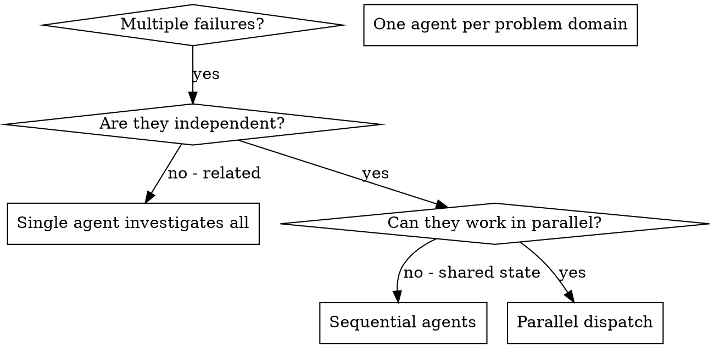

# Dispatching Parallel Agents

## Overview

When you have multiple unrelated failures (different test files, different subsystems, different bugs), investigating them sequentially wastes time. Each investigation is independent and can happen in parallel.

**Core principle:** Dispatch one agent per independent problem domain. Let them work concurrently.

## When to Use



**Use when:**
- 3+ test files failing with different root causes
- Multiple subsystems broken independently
- Each problem can be understood without context from others
- No shared state between investigations

**Don't use when:**
- Failures are related (fix one might fix others)
- Need to understand full system state
- Agents would interfere with each other

## The Pattern

### 1. Identify Independent Domains

Group failures by what's broken:
- File A tests: Tool approval flow
- File B tests: Batch completion behavior
- File C tests: Abort functionality

Each domain is independent - fixing tool approval doesn't affect abort tests.

### 2. Create Focused Agent Tasks

Each agent gets:
- **Specific scope:** One test file or subsystem
- **Clear goal:** Make these tests pass
- **Constraints:** Don't change other code
- **Expected output:** Summary of what you found and fixed

### 3. Dispatch in Parallel

```typescript
// In Claude Code / AI environment
Task("Fix agent-tool-abort.test.ts failures")
Task("Fix batch-completion-behavior.test.ts failures")
Task("Fix tool-approval-race-conditions.test.ts failures")
// All three run concurrently
```

### 4. Review and Integrate

When agents return:
- Read each summary
- Verify fixes don't conflict
- Run full test suite
- Integrate all changes

## Agent Prompt Structure

Good agent prompts are:
1. **Focused** - One clear problem domain
2. **Self-contained** - All context needed to understand the problem
3. **Specific about output** - What should the agent return?

```markdown
Fix the 3 failing tests in src/agents/agent-tool-abort.test.ts:

1. "should abort tool with partial output capture" - expects 'interrupted at' in message
2. "should handle mixed completed and aborted tools" - fast tool aborted instead of completed
3. "should properly track pendingToolCount" - expects 3 results but gets 0

These are timing/race condition issues. Your task:

1. Read the test file and understand what each test verifies
2. Identify root cause - timing issues or actual bugs?
3. Fix by:
   - Replacing arbitrary timeouts with event-based waiting
   - Fixing bugs in abort implementation if found
   - Adjusting test expectations if testing changed behavior

Do NOT just increase timeouts - find the real issue.

Return: Summary of what you found and what you fixed.
```

## Common Mistakes

**❌ Too broad:** "Fix all the tests" - agent gets lost
**✅ Specific:** "Fix agent-tool-abort.test.ts" - focused scope

**❌ No context:** "Fix the race condition" - agent doesn't know where
**✅ Context:** Paste the error messages and test names

**❌ No constraints:** Agent might refactor everything
**✅ Constraints:** "Do NOT change production code" or "Fix tests only"

**❌ Vague output:** "Fix it" - you don't know what changed
**✅ Specific:** "Return summary of root cause and changes"

## Wave Execution for Mixed-Dependency Tasks

When tasks are not all independent — some depend on results from others — group them into dependency waves and run each wave in parallel:

```
Wave 1: All tasks with no dependencies → run in parallel
Wave 2: All tasks that depend only on Wave 1 → run in parallel after Wave 1
Wave 3: All tasks that depend on Wave 2 → run in parallel after Wave 2
```

**Example: building a full-stack feature**
```
Wave 1 (parallel): User model, Product model, Auth service
         ↓ (all complete)
Wave 2 (parallel): Orders API, Cart API  ← both need models from Wave 1
         ↓ (all complete)
Wave 3 (parallel): Checkout UI, Payment UI  ← both need APIs from Wave 2
```

**How to identify waves:**
1. List all tasks
2. For each task, identify what it depends on
3. Tasks with no dependencies → Wave 1
4. Tasks whose dependencies are all in Wave 1 → Wave 2
5. Continue until all tasks are assigned

**Rule:** Never merge waves. If Wave 2 tasks finish early, do not start Wave 3 until all Wave 2 tasks are complete — partial dependency satisfaction is still unsatisfied.

## When NOT to Use

**Related failures:** Fixing one might fix others - investigate together first
**Need full context:** Understanding requires seeing entire system
**Exploratory debugging:** You don't know what's broken yet
**Shared state:** Agents would interfere (editing same files, using same resources)

## Example: Parallel Research

**Scenario:** Evaluating 3 technology options independently

**Tasks:**
- Research option A: performance characteristics and ecosystem maturity
- Research option B: developer experience and tooling
- Research option C: production case studies and adoption

**Why parallel:** Each research task is self-contained. Findings from one don't gate the others.

**Dispatch:**
```
Agent 1 → Research option A performance and ecosystem
Agent 2 → Research option B DX and tooling
Agent 3 → Research option C production cases
```

**Integration:** Each agent returns a summary. Combine results for comparison.

---

## Example: Parallel Debugging

**Scenario:** 6 test failures across 3 files after major refactoring

**Failures:**
- agent-tool-abort.test.ts: 3 failures (timing issues)
- batch-completion-behavior.test.ts: 2 failures (tools not executing)
- tool-approval-race-conditions.test.ts: 1 failure (execution count = 0)

**Decision:** Independent domains - abort logic separate from batch completion separate from race conditions

**Dispatch:**
```
Agent 1 → Fix agent-tool-abort.test.ts
Agent 2 → Fix batch-completion-behavior.test.ts
Agent 3 → Fix tool-approval-race-conditions.test.ts
```

**Results:**
- Agent 1: Replaced timeouts with event-based waiting
- Agent 2: Fixed event structure bug (threadId in wrong place)
- Agent 3: Added wait for async tool execution to complete

**Integration:** All fixes independent, no conflicts, full suite green

**Time saved:** 3 problems solved in parallel vs sequentially

## Key Benefits

1. **Parallelization** - Multiple investigations happen simultaneously
2. **Focus** - Each agent has narrow scope, less context to track
3. **Independence** - Agents don't interfere with each other
4. **Speed** - 3 problems solved in time of 1

## Verification

After agents return:
1. **Review each summary** - Understand what changed
2. **Check for conflicts** - Did agents edit same code?
3. **Run full suite** - Verify all fixes work together
4. **Spot check** - Agents can make systematic errors

## Real-World Impact

From debugging session (2025-10-03):
- 6 failures across 3 files
- 3 agents dispatched in parallel
- All investigations completed concurrently
- All fixes integrated successfully
- Zero conflicts between agent changes
