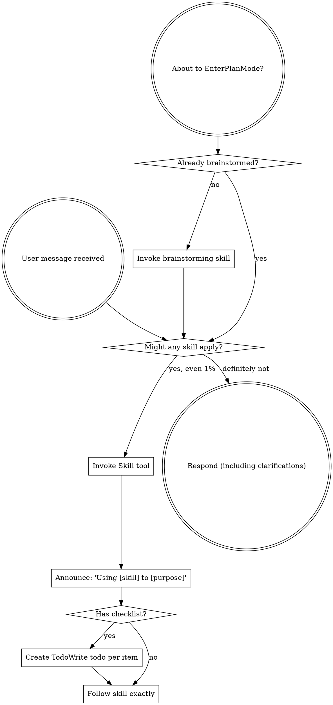

<EXTREMELY-IMPORTANT>
If you think there is even a 1% chance a skill might apply to what you are doing, you ABSOLUTELY MUST invoke the skill.

IF A SKILL APPLIES TO YOUR TASK, YOU DO NOT HAVE A CHOICE. YOU MUST USE IT.

This is not negotiable. This is not optional. You cannot rationalize your way out of this.
</EXTREMELY-IMPORTANT>

## How to Access Skills

**In Claude Code:** Use the `Skill` tool. When you invoke a skill, its content is loaded and presented to you—follow it directly. Never use the Read tool on skill files.

**In other environments:** Check your platform's documentation for how skills are loaded.

# Using Skills

## The Rule

**Invoke relevant or requested skills BEFORE any response or action.** Even a 1% chance a skill might apply means that you should invoke the skill to check. If an invoked skill turns out to be wrong for the situation, you don't need to use it.

## Red Flags

These thoughts mean STOP—you're rationalizing:

| Thought | Reality |
|---------|---------|
| "This is just a simple question" | Questions are tasks. Check for skills. |
| "I need more context first" | Skill check comes BEFORE clarifying questions. |
| "Let me explore the codebase first" | Skills tell you HOW to explore. Check first. |
| "I can check git/files quickly" | Files lack conversation context. Check for skills. |
| "Let me gather information first" | Skills tell you HOW to gather information. |
| "This doesn't need a formal skill" | If a skill exists, use it. |
| "I remember this skill" | Skills evolve. Read current version. |
| "This doesn't count as a task" | Action = task. Check for skills. |
| "The skill is overkill" | Simple things become complex. Use it. |
| "I'll just do this one thing first" | Check BEFORE doing anything. |
| "This feels productive" | Undisciplined action wastes time. Skills prevent this. |
| "I know what that means" | Knowing the concept ≠ using the skill. Invoke it. |

## Skill Catalog

Skills are organized into categories. Invoke by name using the `Skill` tool (e.g. `superpowers:summarizing`).

<!-- CATALOG_START -->
### Plugin Skills

**coding/** — Software development workflow
| Skill | Use when |
|-------|----------|
| `advanced-testing` | Testing web applications interactively, writing or debugging automated E2E tests with Playwright/Cypress, or building evaluation systems for AI agent behavior. Invoke when asked to "test the app", "check if the form works", "verify the login flow", "E2E tests are flaky", "write browser automation", or "design an eval system". |
| `api-design` | Designing or reviewing REST API endpoints — URL structure, HTTP semantics, response formats, pagination, versioning, or authentication headers. Invoke whenever someone asks about endpoint naming, HTTP methods, status codes, request/response shapes, or API versioning strategy. |
| `architecture-patterns` | Designing the high-level structure of a system — choosing between architectural patterns, defining module boundaries, or planning how components interact. Invoke when asked to "architect this", "design the system structure", or "what pattern should we use for this?". |
| `audit-website` | Asked to audit, review, or assess a website's health — covering performance, accessibility, SEO, and code quality. Invoke when someone says "audit the site", "review the website", "check the performance", or "what's wrong with the site". |
| `better-auth` | Implementing authentication — to apply auth best practices, avoid common security pitfalls, and choose the right auth pattern for the use case. Invoke when building login flows, session management, OAuth integration, or any auth-related feature. |
| `ci-cd-pipeline` | Designing, debugging, or reviewing CI/CD pipelines. Invoke when a pipeline is slow or failing, or whenever someone mentions GitHub Actions, CircleCI, Jenkins, Docker builds, or deployment automation. |
| `code-review` | Completing tasks or features and needing review before merging (as requester), when dispatched as a subagent to perform structured review (as reviewer), or when receiving feedback and deciding how to respond (as recipient). Invoke before any merge, push to main, or when receiving review feedback. |
| `codebase-analysis` | Starting work on an unfamiliar codebase to build a working mental model before making any changes, or when asked to examine a codebase, folder, system, or set of files to produce structured findings with no implementation goal yet. Invoke at the start of any session in a new codebase, or when asked to audit, review, analyze, or produce findings about a system. |
| `database-migrations` | Modifying database schemas — adding/removing columns or tables, renaming fields, adding indexes, or performing data migrations. Invoke even for "simple" schema changes like adding a column — there is no trivial migration in production. |
| `dependency-management` | Evaluating whether to add a new dependency, auditing existing dependencies for security issues, managing version pinning, or resolving conflicts. Invoke whenever someone says "install X", "add X dependency", "use X library", or asks to upgrade a package. |
| `diagnosing` | Encountering any bug, test failure, or unexpected behavior before proposing fixes, or when code is too slow, uses too much memory, or has resource usage problems. Invoke whenever something "just stopped working", an error appears, behavior doesn't match expectations, or someone says "this is slow" / "optimize this". |
| `feature-workflow` | Starting any new feature, component, or behavior change before writing any code (brainstorming phase), when you have a spec or requirements for a multi-step task before touching code (planning phase), or when you have a written implementation plan to execute (execution phase). Required gate before ANY implementation. |
| `observability` | Adding logging, metrics, or tracing to a system; reviewing what a service emits in production; or designing alerting. Invoke whenever someone mentions logs, metrics, alerts, dashboards, monitoring, tracing, Datadog, CloudWatch, or Prometheus. |
| `planning-sessions` | Facing multiple candidate features or tasks and needing to decide what order to tackle them — produces a prioritized backlog or sprint plan from a pool of work items. Also use to adversarially stress-test a plan before executing it — invoke when asked to "stress test this plan", "find the holes in this", or "what could go wrong?". |
| `refactoring` | Improving the structure, clarity, or design of existing code without changing its observable behavior. Invoke whenever someone says "clean this up", "this is messy", "reorganize this", or "simplify this code". |
| `search-first` | About to implement new functionality, add a dependency, or create a utility — before writing any code. Invoke before implementing ANY new functionality, even trivial utilities. Check if a library already does this before writing a single line. |
| `security` | Reviewing code for security vulnerabilities before deploying features that handle user input, authentication, authorization, or external data, or when reviewing error handling quality before merging. Invoke whenever code touches input validation, file uploads, tokens, database queries, external APIs, catch blocks, try/except, or fallback values. |
| `supabase-postgres` | Building with Supabase or PostgreSQL — for schema design, query optimization, RLS policies, and database best practices. Invoke when working with Supabase projects, PostgreSQL databases, or when asked about database schema, queries, or policies. |
| `tailwind-design-system` | Building a design system with Tailwind CSS — establishing tokens, component patterns, and consistent styling conventions. Invoke when setting up Tailwind for a project, creating reusable styled components, or asked to "build a design system with Tailwind" or "make Tailwind consistent across the project". |
| `test-driven-development` | Implementing any feature or bugfix, before writing implementation code — even for small changes. Invoke before writing any production code, even if the user doesn't mention "TDD" or "tests". |
| `typescript-advanced-types` | Writing complex TypeScript types — generics, conditional types, mapped types, template literals, or utility types. Invoke when TypeScript types are getting complex, when you need to derive a type from another, or when asked to "type this properly" in TypeScript. |
| `ui-ux-design` | Designing or implementing any user interface — websites, landing pages, dashboards, mobile apps, SaaS products, or UI components. Invoke when building visual components, establishing design tokens, choosing UI patterns, styling layouts, or asked about color, typography, accessibility, responsiveness, or web design guidelines. NOT for general code quality review. |
| `verification-before-completion` | About to claim work is complete, fixed, or passing, before committing or creating PRs. Invoke even when "pretty sure" the work is correct — no completion claim without fresh evidence from a just-run command; evidence before assertions always. |

**agents/** — Agent orchestration
| Skill | Use when |
|-------|----------|
| `autonomous-loops` | Designing Claude to run autonomously in loops — automated pipelines, continuous PR workflows, or multi-agent orchestration. Invoke when designing automated scripts, batch processing, recurring tasks, or any workflow that loops without user input. |
| `dispatching-parallel-agents` | Facing 2+ independent tasks that can be worked on without shared state or sequential dependencies. Invoke whenever work can be split into parallel tracks, even if the user just asks to "do these things". |
| `iterative-retrieval` | A subagent needs to gather relevant context before starting work — especially when the relevant files are not known upfront and broad initial context would exceed limits |
| `llm-council` | A decision is high-stakes and benefits from multiple independent perspectives — to consult multiple reasoning passes, synthesize divergent views, and build consensus before acting. Invoke when the user says "get a second opinion", "think about this from multiple angles", or when a decision is too important to trust to a single reasoning pass. |
| `mcp-server` | Building a custom MCP (Model Context Protocol) server to expose tools, data, or APIs to Claude or other MCP clients. Invoke when someone asks to "expose X as an MCP", "make Claude access my database", "build an MCP server", or wants to create custom tools accessible to Claude. |
| `subagent-driven-development` | Executing implementation plans with independent tasks in the current session. Invoke for any plan with 3+ independent implementation tasks. |
| `swarm-planner` | A large task can be broken into many independent work units that can execute in parallel — to design and coordinate a swarm of agents working concurrently. Invoke when implementing a large feature with separable modules, processing many items in parallel, or when dispatching-parallel-agents isn't enough structure for complex dependency management. |

**git/** — Version control
| Skill | Use when |
|-------|----------|
| `finishing-a-development-branch` | Implementation is complete, all tests pass, and you need to decide how to integrate the work - guides completion of development work by presenting structured options for merge, PR, or cleanup |
| `github-cli` | Working with GitHub issues, CI runs, releases, or repository operations from the terminal. Invoke when someone asks to list/create/close issues, check CI status, create a release, or search GitHub — even if they don't say "gh". |
| `history-archaeology` | You need to understand why code exists, when a bug was introduced, who changed a function, or what a file looked like before. Invoke whenever someone asks "why is this here?", "when did this break?", "who changed this?", or "find the commit that added X". |
| `using-git-worktrees` | Starting feature work that needs isolation from current workspace or before executing implementation plans. Invoke whenever work needs isolation from current state — don't let a feature branch pollute working files. |

**meta/** — Discovery & docs
| Skill | Use when |
|-------|----------|
| `context7` | You need up-to-date documentation for a library, framework, or API before implementing or troubleshooting. Invoke before using any external library — to fetch current docs instead of relying on training data, which may be outdated. |
| `find-skills` | Looking for skills to install, discovering what skills exist on skills.sh, or when asked "is there a skill for X?". Invoke when the user wants to find, search, or browse available agent skills from the skills.sh marketplace. |
<!-- CATALOG_END -->

## Skill Priority

When multiple skills could apply:

1. **Process skills first** (brainstorming, debugging) — these determine HOW to approach the task
2. **Output skills second** (summarizing, drafting, explaining) — these guide what to produce

"Let's build X" → brainstorming first.
"Fix this bug" → systematic-debugging first.

## Skill Types

**Rigid** (TDD, debugging): Follow exactly. Don't adapt away discipline.

**Flexible** (patterns): Adapt principles to context.

The skill itself tells you which.

## User Instructions

Instructions say WHAT, not HOW. "Add X" or "Fix Y" doesn't mean skip workflows.
