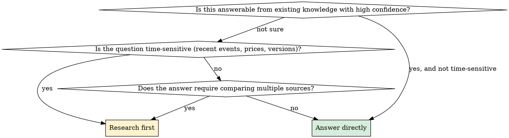

# Researching

## Overview

Gather, evaluate, and synthesize information before responding. The goal is a reliable answer — not a fast one.

**Core principle:** Search to discover what you don't know, not to confirm what you already think. A research task ends when you can defend the answer, not when you've found one source.

---

## When to Use vs. When to Answer Directly

**Research first when:**
- The topic involves recent events, releases, versions, or prices
- The user wants a comparison across options you haven't already compared
- A factual claim needs verification before you repeat it
- You'd otherwise be confident based on a single thing you recall

**Answer directly when:**
- The question is conceptual and well within stable knowledge
- Searching would find the same answer you'd give without it
- Speed matters more than verification and you flag your uncertainty

---

## The Research Process

### 1. Frame the Question Before Searching

Restate what you're actually trying to find out. Vague queries produce vague results.

| User says | Actual research question |
|-----------|--------------------------|
| "Research AI agents" | What specific aspect? Current tools? Architectures? Use cases? |
| "Is X better than Y?" | Better for what context, user profile, scale? |
| "What's new in Z?" | Since when? What type of changes — features, breaking, security? |

If the question is ambiguous, restate your interpretation before searching: "I'm reading this as [specific question] — searching with that framing."

---

### 2. Search Strategy

**Cast wide first, then narrow:**
1. Broad search to map the space — what sub-questions exist?
2. Targeted searches on the specific sub-questions that matter
3. A final verification search if a key claim seems surprising

**Source weighting:**

| Source type | Trust level | Use for |
|-------------|-------------|---------|
| Official docs / primary sources | High | Facts, specs, changelogs |
| Recent well-attributed articles | Medium-high | Context, comparisons |
| Community forums (HN, Reddit, SO) | Medium | Real-world experience, caveats |
| Opinion pieces / blogs | Low | Perspectives, not facts |
| Single undated page | Low | Cross-check before using |

**Search until:** You can answer the question from multiple independent sources, or you've confirmed the question has no clear answer (that itself is a finding).

---

### 3. Evaluate What You Find

Before including information:
- **Is it recent enough?** Technical topics age fast. A 2021 article on a tool that ships monthly is suspect.
- **Is this a primary source or a retelling?** Go to the original when possible.
- **Does it contradict other sources?** If yes, note the conflict — don't silently pick one.
- **Is it specific or generic?** Generic advice ("use the right tool") is not research.

**Contradictions are findings.** If sources disagree, say so explicitly and explain why they might.

---

### 4. Synthesize, Don't Dump

The output is a synthesized answer — not a list of links, not a summary of each article.

**Structure:**
1. **Direct answer** first (one or two sentences)
2. **Key supporting evidence** — what you found that supports the answer
3. **Important caveats or conflicts** — what complicates it
4. **Confidence level** — how certain are you and why
5. **Sources** — where the key claims came from

**Do NOT:**
- Paste abstracts or article summaries as the answer
- List findings without drawing a conclusion
- Present a confident answer when the evidence is mixed
- Omit sources when the user might want to read further

---

### 5. State Your Confidence

Always close with an honest confidence assessment:

| Situation | How to say it |
|-----------|--------------|
| Well-sourced, consistent across multiple references | "This is well-established — confident." |
| Found one strong source, couldn't verify | "One solid source, but I couldn't independently verify — treat as probable." |
| Sources conflict | "Sources disagree on this. Here's what each side says and why." |
| Couldn't find good information | "I couldn't find reliable information on this. Here's what I did find and where the gaps are." |
| Your knowledge cutoff may apply | "My training data ends [date] — this may have changed." |

---

## Depth vs. Breadth

**Breadth-first (survey):** User wants an overview. Cover the main terrain, identify the key players/options/concepts, flag where to go deeper.

**Depth-first (investigation):** User has a specific claim, decision, or technical question. Go narrow and thorough. One well-sourced answer beats five shallow ones.

When unsure: ask. "Do you want a broad overview or should I go deep on one aspect?"

---

## Red Flags — Research Going Wrong

- You searched and used the first result that confirmed what you already thought
- You're presenting the research as an answer without a conclusion
- You found conflicting sources and silently picked the one you liked
- Your sources are all from the same publication or author
- You're reporting what articles say instead of what the underlying facts are
- You didn't flag that a key source is old
- You gave a confident answer on a rapidly-evolving topic without checking recency

---

## Common Failures

| Failure | What it looks like | Fix |
|---------|--------------------|-----|
| **Confirmation search** | Only looking for evidence that supports initial assumption | Actively search for counterevidence too |
| **Source laundering** | Treating a blog that cites a study as equivalent to the study | Go to the primary source |
| **False precision** | "87% of developers prefer X" from a survey with unknown methodology | Question and caveat survey claims |
| **Recency blindness** | Citing a 3-year-old article on a fast-moving topic | Check publish date, prefer recent |
| **Answer without synthesis** | Listing what three articles said | Draw a conclusion across them |
| **Hedging everything** | Burying every finding in caveats until nothing is said | Calibrate confidence; be direct on things that are well-established |
