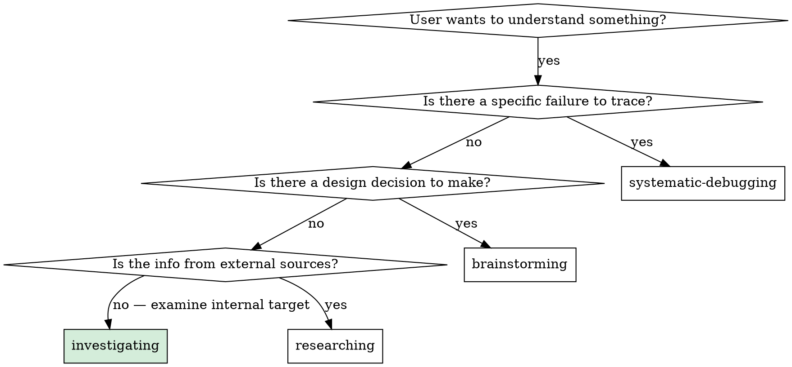

# Investigating

## Overview

Systematically examine a target and produce a structured findings report.

**Core principle:** Read everything before analyzing anything. Conclusions written before full examination are biases, not findings.

## When to Use



**Use when:**
- Asked to audit, review, or analyze a system, codebase, folder, or set of files
- Asked for advantages, disadvantages, flaws, gaps, or quality assessment
- No implementation goal exists yet — findings are the end product
- The user wants a map of what's there before deciding what to do

**Do NOT use when:**
- There is a specific bug or failure → `systematic-debugging`
- There is a design decision to make → `brainstorming`
- Information comes from external sources → `researching`
- The user already knows what to build → `writing-plans`

## The Process

### Step 1: Scope the Investigation

Before reading anything, establish:
- **Target:** What exactly is being examined? (folder, system, specific files, all of X)
- **Questions to answer:** What should the report tell the user? (quality? gaps? flaws? all aspects?)
- **Depth:** Skim for overview vs. read everything completely?

If unclear, ask one question: "Should I examine everything in X, or focus on a specific aspect?"

### Step 2: Read Everything First

Read **all** files, skills, components, or content in scope before drawing any conclusions.

- Don't stop to analyze mid-read
- Don't skip files that look unimportant
- Take notes on observations but make no judgments yet
- If scope is large, use parallel reads where possible

**The rule:** No section of the report is written until all reading is complete.

### Step 3: Analyze Systematically

After reading everything, analyze across these dimensions (scale depth to the target):

| Dimension | Questions to answer |
|-----------|---------------------|
| **Advantages** | What works well? What is well-designed? |
| **Disadvantages** | What is suboptimal but not broken? What is missing? |
| **Flaws** | What is actively broken, incorrect, or causes failures? |
| **Optimizations** | What specific changes would improve the target? |
| **Gaps** | What should exist but doesn't? |
| **Cross-item patterns** | What systemic issues apply to multiple items? |

For each **flaw**, assign severity:
- **Critical** — breaks functionality or causes failures
- **High** — incorrect behavior in key scenarios
- **Medium** — suboptimal but workable
- **Low** — style or consistency issues

### Step 4: Write the Report

Write findings to files — don't just return them in chat. Large investigations warrant multiple files.

**Recommended report structure:**

```
investigation-report/
  README.md              — executive summary + file index
  01-overview.md         — system-level analysis (architecture, advantages, disadvantages)
  02-per-item-analysis.md — individual item breakdown
  03-critical-flaws.md   — bugs/issues ranked by severity, each with a concrete fix
  04-optimizations.md    — improvements with effort/impact assessment
  05-gaps.md             — missing elements and strategic observations
```

Scale to the investigation: a small target may need only one file.

**Each finding must include:**
- Specific location (file:line or named component)
- What the issue is
- Why it matters
- For flaws: a concrete fix

**Vague findings are not findings.** "Could be better" is not a finding. "Line 55 references `frontend-design` which does not exist in this skill collection — causes model confusion" is a finding.

### Step 5: Present and Confirm

After writing:
- Tell the user where the report is
- Give a 3–5 bullet executive summary
- Ask: "Anything you want me to investigate more deeply?"

## Common Failures

| Failure | What it looks like | Fix |
|---------|--------------------|-----|
| **Premature analysis** | Drawing conclusions before reading everything | Finish all reads first |
| **Vague findings** | "The system could be improved" | File:line, what, why, how to fix |
| **Missing severity** | All findings treated as equal weight | Rank: Critical → High → Medium → Low |
| **Solution creep** | Starting to implement fixes mid-investigation | Stop. Write the finding. Fixes come after. |
| **Coverage gaps** | Skipping files that look boring | Read everything in scope — blind spots hide there |
| **Chat-only output** | Returning findings in a message, not in files | Large investigations need persistent reports |
| **Missing patterns** | Analyzing items in isolation | After per-item, look for cross-cutting themes |

## Red Flags — Stop Investigating, You've Drifted

- You are writing code or editing files
- You have proposed a solution before finishing all reads
- Your findings say "good overall" without specific evidence
- You analyzed only the interesting parts and skipped the rest
- You wrote conclusions in chat instead of a report file
- The user asked "what's wrong with X" and you answered from memory without examining X

## Integration

**Investigation findings → next steps:**

| Finding type | Next skill |
|--------------|-----------|
| Broken functionality (bugs) | `systematic-debugging` — trace and fix root cause |
| Design gaps or new features wanted | `brainstorming` — design before building |
| Clear list of fixes needed | `writing-plans` — plan the fixes as tasks |
| No action needed | Done — report is the deliverable |

**Commonly preceded by:** Nothing — investigation is often the first step.

**Commonly followed by:** `brainstorming` or `writing-plans` depending on what the findings reveal.
