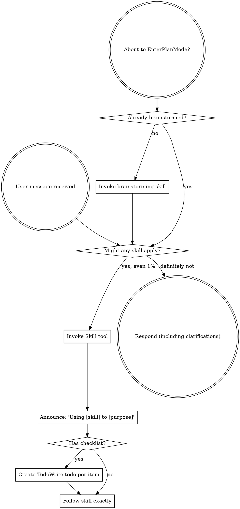

<EXTREMELY-IMPORTANT>
If you think there is even a 1% chance a skill might apply to what you are doing, you ABSOLUTELY MUST invoke the skill.

IF A SKILL APPLIES TO YOUR TASK, YOU DO NOT HAVE A CHOICE. YOU MUST USE IT.

This is not negotiable. This is not optional. You cannot rationalize your way out of this.
</EXTREMELY-IMPORTANT>

## How to Access Skills

**In Claude Code:** Use the `Skill` tool. When you invoke a skill, its content is loaded and presented to you—follow it directly. Never use the Read tool on skill files.

**In other environments:** Check your platform's documentation for how skills are loaded.

# Using Skills

## The Rule

**Invoke relevant or requested skills BEFORE any response or action.** Even a 1% chance a skill might apply means that you should invoke the skill to check. If an invoked skill turns out to be wrong for the situation, you don't need to use it.

## Red Flags

These thoughts mean STOP—you're rationalizing:

| Thought | Reality |
|---------|---------|
| "This is just a simple question" | Questions are tasks. Check for skills. |
| "I need more context first" | Skill check comes BEFORE clarifying questions. |
| "Let me explore the codebase first" | Skills tell you HOW to explore. Check first. |
| "I can check git/files quickly" | Files lack conversation context. Check for skills. |
| "Let me gather information first" | Skills tell you HOW to gather information. |
| "This doesn't need a formal skill" | If a skill exists, use it. |
| "I remember this skill" | Skills evolve. Read current version. |
| "This doesn't count as a task" | Action = task. Check for skills. |
| "The skill is overkill" | Simple things become complex. Use it. |
| "I'll just do this one thing first" | Check BEFORE doing anything. |
| "This feels productive" | Undisciplined action wastes time. Skills prevent this. |
| "I know what that means" | Knowing the concept ≠ using the skill. Invoke it. |

## Skill Catalog

Skills are organized into categories. Invoke by name using the `Skill` tool (e.g. `superpowers:summarizing`).

<!-- CATALOG_START -->
**coding/** — Software development workflow
| Skill | Use when |
|-------|----------|
| `api-design` | Designing or reviewing REST API endpoints — URL structure, HTTP semantics, response formats, pagination, versioning, or authentication headers |
| `brainstorming` | Starting any new feature, component, behavior change, or modification — before writing any code. Required gate before implementation. |
| `ci-cd-pipeline` | Designing, debugging, or reviewing CI/CD pipelines — pipeline structure, caching strategy, secrets management, deployment strategies, or troubleshooting failed pipeline runs |
| `code-reviewer` | Dispatched as a subagent to perform structured code review — examines implementation against spec for compliance, then assesses code quality and best practices |
| `database-migrations` | Modifying database schemas — adding/removing columns or tables, renaming fields, adding indexes, or performing data migrations — especially in production environments |
| `dependency-management` | Evaluating whether to add a new dependency, auditing existing dependencies for security issues, managing version pinning strategy, or resolving dependency conflicts |
| `e2e-testing` | Writing, organizing, or debugging end-to-end tests — browser automation, Page Object Model structure, flaky test management, or CI/CD integration for E2E suites |
| `eval-harness` | Building, running, or designing evaluation systems for AI agent behavior — measuring reliability, detecting regressions, or implementing eval-driven development workflows |
| `executing-plans` | You have a written implementation plan to execute in a separate session with review checkpoints |
| `investigating` | Asked to examine a codebase, folder, system, or set of files to produce structured findings — with no implementation goal yet. The investigation is the deliverable, not a step toward something else. |
| `observability` | Adding logging, metrics, or tracing to a system; reviewing what a service emits in production; or designing alerting thresholds and on-call policies |
| `onboarding-to-codebase` | Starting work on an unfamiliar codebase, repository, or service — to build a working mental model before making any changes |
| `performance-profiling` | Code is too slow, uses too much memory, or has resource usage problems — before making any optimization changes |
| `planning-sessions` | Facing multiple candidate features or tasks and needing to decide what order to tackle them — produces a prioritized backlog or sprint plan from a pool of work items |
| `receiving-code-review` | Receiving code review feedback, before implementing suggestions, especially if feedback seems unclear or technically questionable - requires technical rigor and verification, not performative agreement or blind implementation |
| `refactoring` | Improving the structure, clarity, or design of existing code without changing its observable behavior — before making structural changes to working code |
| `requesting-code-review` | Completing tasks, implementing major features, or before merging to verify work meets requirements |
| `search-first` | About to implement new functionality, add a dependency, or create a utility — before writing any code, to search for existing solutions that may already solve the problem |
| `security-review` | Reviewing code for security vulnerabilities — before deploying features that handle user input, authentication, authorization, secrets, or external data |
| `systematic-debugging` | Encountering any bug, test failure, or unexpected behavior, before proposing fixes |
| `test-driven-development` | Implementing any feature or bugfix, before writing implementation code |
| `verification-before-completion` | About to claim work is complete, fixed, or passing, before committing or creating PRs - requires running verification commands and confirming output before making any success claims; evidence before assertions always |
| `writing-plans` | You have a spec or requirements for a multi-step task, before touching code |

**agents/** — Agent orchestration
| Skill | Use when |
|-------|----------|
| `autonomous-loops` | Designing Claude to run autonomously in loops — automated pipelines, continuous PR workflows, multi-agent orchestration, or recurring background tasks |
| `dispatching-parallel-agents` | Facing 2+ independent tasks that can be worked on without shared state or sequential dependencies |
| `iterative-retrieval` | A subagent needs to gather relevant context before starting work — especially when the relevant files are not known upfront and broad initial context would exceed limits |
| `subagent-driven-development` | Executing implementation plans with independent tasks in the current session |

**git/** — Version control
| Skill | Use when |
|-------|----------|
| `finishing-a-development-branch` | Implementation is complete, all tests pass, and you need to decide how to integrate the work - guides completion of development work by presenting structured options for merge, PR, or cleanup |
| `using-git-worktrees` | Starting feature work that needs isolation from current workspace or before executing implementation plans - creates isolated git worktrees with smart directory selection and safety verification |

**thinking/** — Intellectual engagement
| Skill | Use when |
|-------|----------|
| `decision-making` | Facing a choice between concrete options and needing a rigorous, structured process to evaluate and commit — especially for high-stakes, irreversible, or complex decisions |
| `reasoning` | Facing a complex problem that needs structured thinking tools — first principles decomposition, pre-mortem analysis, assumption mapping, or inversion — to think more clearly before deciding or acting |
| `thinking-partner` | The user wants opinions, wants to brainstorm non-technical ideas, presents a claim to be challenged, asks "what do you think", wants to think something through out loud, or wants genuine intellectual engagement rather than task execution |

**qol/** — Output production
| Skill | Use when |
|-------|----------|
| `documenting` | Writing technical documentation — READMEs, API docs, architecture decision records, CHANGELOG entries, or any persistent reference meant to be read by engineers later |
| `drafting` | The user wants to write a message, email, Slack post, announcement, or any communication — especially when they describe what they want to say but need it shaped into the right form, tone, or structure |
| `explaining` | The user asks to explain something, says "help me understand", "what is X", "break this down", "explain like I'm a [level]", or is clearly confused about a concept or system |
| `researching` | The user asks to research a topic, find information, compare options, investigate a claim, or needs a synthesized answer from multiple sources rather than a direct response from existing knowledge |
| `summarizing` | The user shares long content (article, document, thread, meeting notes, code) and wants key points, a tldr, a condensed version, or asks "what's important here" or "give me the gist |

**meta/** — Skill system
| Skill | Use when |
|-------|----------|
| `capturing-context` | The user explicitly says "extract the context" or "extract context" — captures everything from the current session that the next conversation needs to continue without losing state |
| `prompt-efficiency` | Writing prompts, agent task descriptions, or skill instructions — to eliminate wasted tokens and get the right output in fewer rounds |
| `prompt-generator` | Asked to generate a prompt, system prompt, briefing document, or reusable instruction set — produces a structured, efficient prompt saved to a markdown file |
| `sensitive-data-guard` | Shared content may contain sensitive data — API keys, passwords, tokens, private keys, credentials, PII, or connection strings — before proceeding with any task involving that content |
| `session-resume` | Starting a session and wanting to restore state from a previous session — loads the most recent context log, reconstructs working state, and confirms with the user before resuming |
| `skill-stocktake` | Auditing the current skill system — evaluating skill quality, identifying overlaps or gaps, retiring outdated skills, or planning the next round of skill improvements |
| `writing-skills` | Creating new skills, editing existing skills, or verifying skills work before deployment |
<!-- CATALOG_END -->

## Skill Priority

When multiple skills could apply:

1. **Process skills first** (brainstorming, debugging) — these determine HOW to approach the task
2. **Output skills second** (summarizing, drafting, explaining) — these guide what to produce

"Let's build X" → brainstorming first.
"Fix this bug" → systematic-debugging first.

## Skill Types

**Rigid** (TDD, debugging): Follow exactly. Don't adapt away discipline.

**Flexible** (patterns): Adapt principles to context.

The skill itself tells you which.

## User Instructions

Instructions say WHAT, not HOW. "Add X" or "Fix Y" doesn't mean skip workflows.
