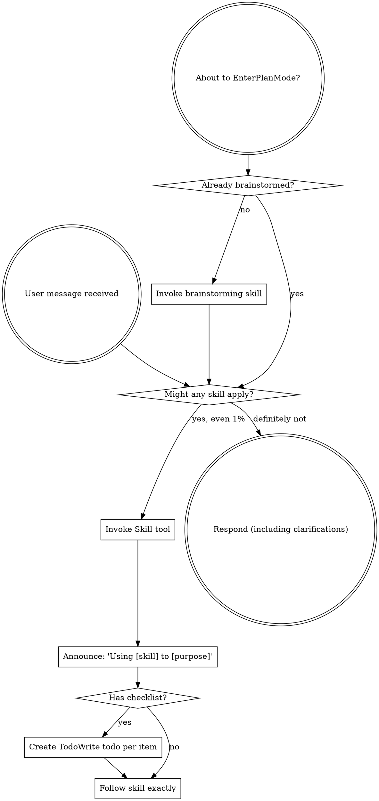

<EXTREMELY-IMPORTANT>
If you think there is even a 1% chance a skill might apply to what you are doing, you ABSOLUTELY MUST invoke the skill.

IF A SKILL APPLIES TO YOUR TASK, YOU DO NOT HAVE A CHOICE. YOU MUST USE IT.

This is not negotiable. This is not optional. You cannot rationalize your way out of this.
</EXTREMELY-IMPORTANT>

## How to Access Skills

**In Claude Code:** Use the `Skill` tool. When you invoke a skill, its content is loaded and presented to you—follow it directly. Never use the Read tool on skill files.

**In other environments:** Check your platform's documentation for how skills are loaded.

# Using Skills

## The Rule

**Invoke relevant or requested skills BEFORE any response or action.** Even a 1% chance a skill might apply means that you should invoke the skill to check. If an invoked skill turns out to be wrong for the situation, you don't need to use it.

## Red Flags

These thoughts mean STOP—you're rationalizing:

| Thought | Reality |
|---------|---------|
| "This is just a simple question" | Questions are tasks. Check for skills. |
| "I need more context first" | Skill check comes BEFORE clarifying questions. |
| "Let me explore the codebase first" | Skills tell you HOW to explore. Check first. |
| "I can check git/files quickly" | Files lack conversation context. Check for skills. |
| "Let me gather information first" | Skills tell you HOW to gather information. |
| "This doesn't need a formal skill" | If a skill exists, use it. |
| "I remember this skill" | Skills evolve. Read current version. |
| "This doesn't count as a task" | Action = task. Check for skills. |
| "The skill is overkill" | Simple things become complex. Use it. |
| "I'll just do this one thing first" | Check BEFORE doing anything. |
| "This feels productive" | Undisciplined action wastes time. Skills prevent this. |
| "I know what that means" | Knowing the concept ≠ using the skill. Invoke it. |

## Skill Catalog

Skills are organized into categories. Invoke by name using the `Skill` tool (e.g. `superpowers:summarizing`).

**coding/** — Software development workflow
| Skill | Use when |
|-------|----------|
| `brainstorming` | Planning any new feature or change — before writing code |
| `writing-plans` | Design approved, need it broken into tasks |
| `executing-plans` | Running a plan step-by-step with human checkpoints |
| `test-driven-development` | Implementing any feature or bugfix |
| `systematic-debugging` | Something is broken and root cause is unknown |
| `verification-before-completion` | About to declare work done |
| `requesting-code-review` | Code ready, requesting review |
| `receiving-code-review` | Responding to review feedback |

**agents/** — Agent orchestration
| Skill | Use when |
|-------|----------|
| `subagent-driven-development` | Executing independent plan tasks in same session with auto-review |
| `dispatching-parallel-agents` | Running multiple tasks concurrently across separate sessions |

**git/** — Version control
| Skill | Use when |
|-------|----------|
| `using-git-worktrees` | Starting implementation that shouldn't touch main |
| `finishing-a-development-branch` | Tasks done — merge, PR, keep, or discard |

**thinking/** — Intellectual engagement
| Skill | Use when |
|-------|----------|
| `thinking-partner` | User wants opinions, ideas challenged, or to think out loud |

**qol/** — Output production
| Skill | Use when |
|-------|----------|
| `researching` | Need to find and synthesize information from external sources |
| `summarizing` | User has content and wants it condensed |
| `explaining` | User needs a concept made understandable |
| `drafting` | User needs a message, email, or communication written |

**meta/** — Skill system
| Skill | Use when |
|-------|----------|
| `writing-skills` | Creating or editing a SKILL.md |
| `capturing-context` | User explicitly says "extract the context" |

## Skill Priority

When multiple skills could apply:

1. **Process skills first** (brainstorming, debugging) — these determine HOW to approach the task
2. **Output skills second** (summarizing, drafting, explaining) — these guide what to produce

"Let's build X" → brainstorming first.
"Fix this bug" → systematic-debugging first.

## Skill Types

**Rigid** (TDD, debugging): Follow exactly. Don't adapt away discipline.

**Flexible** (patterns): Adapt principles to context.

The skill itself tells you which.

## User Instructions

Instructions say WHAT, not HOW. "Add X" or "Fix Y" doesn't mean skip workflows.
