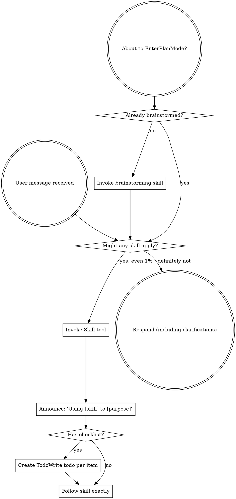

<EXTREMELY-IMPORTANT>
If you think there is even a 1% chance a skill might apply to what you are doing, you ABSOLUTELY MUST invoke the skill.

IF A SKILL APPLIES TO YOUR TASK, YOU DO NOT HAVE A CHOICE. YOU MUST USE IT.

This is not negotiable. This is not optional. You cannot rationalize your way out of this.
</EXTREMELY-IMPORTANT>

## How to Access Skills

**In Claude Code:** Use the `Skill` tool. When you invoke a skill, its content is loaded and presented to you—follow it directly. Never use the Read tool on skill files.

**In other environments:** Check your platform's documentation for how skills are loaded.

# Using Skills

## The Rule

**Invoke relevant or requested skills BEFORE any response or action.** Even a 1% chance a skill might apply means that you should invoke the skill to check. If an invoked skill turns out to be wrong for the situation, you don't need to use it.

## Red Flags

These thoughts mean STOP—you're rationalizing:

| Thought | Reality |
|---------|---------|
| "This is just a simple question" | Questions are tasks. Check for skills. |
| "I need more context first" | Skill check comes BEFORE clarifying questions. |
| "Let me explore the codebase first" | Skills tell you HOW to explore. Check first. |
| "I can check git/files quickly" | Files lack conversation context. Check for skills. |
| "Let me gather information first" | Skills tell you HOW to gather information. |
| "This doesn't need a formal skill" | If a skill exists, use it. |
| "I remember this skill" | Skills evolve. Read current version. |
| "This doesn't count as a task" | Action = task. Check for skills. |
| "The skill is overkill" | Simple things become complex. Use it. |
| "I'll just do this one thing first" | Check BEFORE doing anything. |
| "This feels productive" | Undisciplined action wastes time. Skills prevent this. |
| "I know what that means" | Knowing the concept ≠ using the skill. Invoke it. |

## Skill Catalog

Skills are organized into categories. Invoke by name using the `Skill` tool (e.g. `superpowers:summarizing`).

<!-- CATALOG_START -->
**coding/** — Software development workflow
| Skill | Use when |
|-------|----------|
| `advanced-testing` | Writing, organizing, or debugging end-to-end tests with Playwright, Cypress, or Selenium, or when building evaluation systems for AI agent behavior to measure reliability or detect regressions. Invoke when E2E tests are flaky, slow, or missing, when browser automation is needed, or when designing eval-driven development workflows. |
| `api-design` | Designing or reviewing REST API endpoints — URL structure, HTTP semantics, response formats, pagination, versioning, or authentication headers. Invoke whenever someone asks about endpoint naming, HTTP methods, status codes, request/response shapes, or API versioning strategy. |
| `ci-cd-pipeline` | Designing, debugging, or reviewing CI/CD pipelines. Invoke when a pipeline is slow or failing, or whenever someone mentions GitHub Actions, CircleCI, Jenkins, Docker builds, or deployment automation. |
| `code-review` | Completing tasks or features and needing review before merging (as requester), when dispatched as a subagent to perform structured review (as reviewer), or when receiving feedback and deciding how to respond (as recipient). Invoke before any merge, push to main, or when receiving review feedback. |
| `codebase-analysis` | Starting work on an unfamiliar codebase to build a working mental model before making any changes, or when asked to examine a codebase, folder, system, or set of files to produce structured findings with no implementation goal yet. Invoke at the start of any session in a new codebase, or when asked to audit, review, analyze, or produce findings about a system. |
| `database-migrations` | Modifying database schemas — adding/removing columns or tables, renaming fields, adding indexes, or performing data migrations. Invoke even for "simple" schema changes like adding a column — there is no trivial migration in production. |
| `dependency-management` | Evaluating whether to add a new dependency, auditing existing dependencies for security issues, managing version pinning, or resolving conflicts. Invoke whenever someone says "install X", "add X dependency", "use X library", or asks to upgrade a package. |
| `diagnosing` | Encountering any bug, test failure, or unexpected behavior before proposing fixes, or when code is too slow, uses too much memory, or has resource usage problems. Invoke whenever something "just stopped working", an error appears, behavior doesn't match expectations, or someone says "this is slow" / "optimize this". |
| `feature-workflow` | Starting any new feature, component, or behavior change before writing any code (brainstorming phase), when you have a spec or requirements for a multi-step task before touching code (planning phase), or when you have a written implementation plan to execute (execution phase). Required gate before ANY implementation. |
| `observability` | Adding logging, metrics, or tracing to a system; reviewing what a service emits in production; or designing alerting. Invoke whenever someone mentions logs, metrics, alerts, dashboards, monitoring, tracing, Datadog, CloudWatch, or Prometheus. |
| `planning-sessions` | Facing multiple candidate features or tasks and needing to decide what order to tackle them — produces a prioritized backlog or sprint plan from a pool of work items |
| `refactoring` | Improving the structure, clarity, or design of existing code without changing its observable behavior. Invoke whenever someone says "clean this up", "this is messy", "reorganize this", or "simplify this code". |
| `search-first` | About to implement new functionality, add a dependency, or create a utility — before writing any code. Invoke before implementing ANY new functionality, even trivial utilities. Check if a library already does this before writing a single line. |
| `security` | Reviewing code for security vulnerabilities before deploying features that handle user input, authentication, authorization, or external data, or when reviewing error handling quality before merging. Invoke whenever code touches input validation, file uploads, tokens, database queries, external APIs, catch blocks, try/except, or fallback values. |
| `test-driven-development` | Implementing any feature or bugfix, before writing implementation code — even for small changes. Invoke before writing any production code, even if the user doesn't mention "TDD" or "tests". |
| `ui-ux-design` | Designing or implementing any user interface — websites, landing pages, dashboards, mobile apps, or SaaS products. Invoke even if the user doesn't say "UI" or "UX"; trigger on requests to build, create, style, implement, improve, or fix any visual interface, component, or layout. Also invoke when the user asks about color, typography, animations, accessibility, or responsiveness. NOT for general code quality review (use code-reviewer for that) — this skill covers visual design correctness: styling, layout, industry-appropriate aesthetics, accessibility compliance, and UX patterns. |
| `verification-before-completion` | About to claim work is complete, fixed, or passing, before committing or creating PRs. Invoke even when "pretty sure" the work is correct — no completion claim without fresh evidence from a just-run command; evidence before assertions always. |

**agents/** — Agent orchestration
| Skill | Use when |
|-------|----------|
| `autonomous-loops` | Designing Claude to run autonomously in loops — automated pipelines, continuous PR workflows, or multi-agent orchestration. Invoke when designing automated scripts, batch processing, recurring tasks, or any workflow that loops without user input. |
| `dispatching-parallel-agents` | Facing 2+ independent tasks that can be worked on without shared state or sequential dependencies. Invoke whenever work can be split into parallel tracks, even if the user just asks to "do these things". |
| `iterative-retrieval` | A subagent needs to gather relevant context before starting work — especially when the relevant files are not known upfront and broad initial context would exceed limits |
| `mcp-server` | Building a custom MCP (Model Context Protocol) server to expose tools, data, or APIs to Claude or other MCP clients. Invoke when someone asks to "expose X as an MCP", "make Claude access my database", "build an MCP server", or wants to create custom tools accessible to Claude. |
| `subagent-driven-development` | Executing implementation plans with independent tasks in the current session. Invoke for any plan with 3+ independent implementation tasks. |

**git/** — Version control
| Skill | Use when |
|-------|----------|
| `finishing-a-development-branch` | Implementation is complete, all tests pass, and you need to decide how to integrate the work - guides completion of development work by presenting structured options for merge, PR, or cleanup |
| `github-cli` | Working with GitHub issues, CI runs, releases, or repository operations from the terminal. Invoke when someone asks to list/create/close issues, check CI status, create a release, or search GitHub — even if they don't say "gh". |
| `history-archaeology` | You need to understand why code exists, when a bug was introduced, who changed a function, or what a file looked like before. Invoke whenever someone asks "why is this here?", "when did this break?", "who changed this?", or "find the commit that added X". |
| `using-git-worktrees` | Starting feature work that needs isolation from current workspace or before executing implementation plans. Invoke whenever work needs isolation from current state — don't let a feature branch pollute working files. |

**thinking/** — Intellectual engagement
| Skill | Use when |
|-------|----------|
| `decision-making` | Facing a choice between concrete options and needing a rigorous, structured process to evaluate and commit. Invoke for any significant choice, even when the user just asks "which should I use?" or "what's better, X or Y? |
| `reasoning` | Facing a complex problem that needs structured thinking tools — first principles decomposition, pre-mortem analysis, assumption mapping, or inversion — to think more clearly before deciding or acting |
| `thinking-partner` | The user wants opinions, wants to brainstorm non-technical ideas, presents a claim to be challenged, or asks "what do you think". Invoke when the user seems to be wrestling with an idea, thinking out loud, or wants a genuine reaction rather than task execution. |

**qol/** — Output production
| Skill | Use when |
|-------|----------|
| `documenting` | Writing technical documentation — READMEs, API docs, architecture decision records, or CHANGELOG entries. Invoke whenever someone says "add a README", "write docs for this", "document this function", or "add a changelog entry". |
| `drafting` | The user wants to write a message, email, Slack post, announcement, or any communication — especially when they describe what they want to say but need it shaped into the right form, tone, or structure |
| `explaining` | The user asks to explain something, seems confused, or asks a "why" or "how does X work" question. Invoke whenever someone says "help me understand", "what is X", "break this down", or shows signs of not following a concept. |
| `grammar-mirror` | The user's message contains grammatical errors, awkward phrasing, or unclear sentence structure — especially when they appear to be a non-native speaker or write casually. Always show the corrected version of their input first, then answer. |
| `researching` | The user asks to research a topic, compare options, or investigate a claim. Invoke whenever comparing options, investigating a claim, or needing a synthesized answer the user can rely on — even if they don't say "research this". |
| `summarizing` | The user shares long content and wants key points, a tldr, or a condensed version. Invoke whenever content is shared that's longer than a person would want to read in full — meetings, threads, articles, PRs, docs. |

**meta/** — Skill system
| Skill | Use when |
|-------|----------|
| `claude-md-improver` | Auditing, improving, or updating CLAUDE.md files — to keep project memory aligned with the actual codebase. Invoke when a CLAUDE.md might be stale, incomplete, or generic, or when the user asks to "audit the CLAUDE.md" or "check if CLAUDE.md is up to date". |
| `prompting` | Writing prompts, agent task descriptions, or skill instructions and they are getting long, repetitive, or unclear (efficiency mode), or when asked to generate a reusable prompt, system prompt, briefing document, or instruction set from scratch (generation mode). Invoke before sending any prompt to a subagent or external model, or when the user says "generate a prompt", "create a system prompt", or wants to export a workflow as reusable instructions. |
| `sensitive-data-guard` | Shared content may contain sensitive data — API keys, passwords, tokens, private keys, credentials, PII, or connection strings — before proceeding with any task involving that content |
| `session-memory` | Use proactively during a session to write searchable observations at natural pause points (after research, decisions, blockers, or topic switches), or when the user says "extract context" / "save progress" / "checkpoint" to save full session state, or when starting a session and wanting to restore state from a previous session. |
| `skill-management` | Creating a new skill, improving or testing an existing skill, or optimizing a skill's description for better triggering (creation phase), or when auditing the current skill system to evaluate quality, find overlaps, or plan improvements (stocktake phase). Invoke after adding 5+ new skills, after a major workflow change, or when a skill seems to fire in the wrong context. |
<!-- CATALOG_END -->

## Skill Priority

When multiple skills could apply:

1. **Process skills first** (brainstorming, debugging) — these determine HOW to approach the task
2. **Output skills second** (summarizing, drafting, explaining) — these guide what to produce

"Let's build X" → brainstorming first.
"Fix this bug" → systematic-debugging first.

## Skill Types

**Rigid** (TDD, debugging): Follow exactly. Don't adapt away discipline.

**Flexible** (patterns): Adapt principles to context.

The skill itself tells you which.

## User Instructions

Instructions say WHAT, not HOW. "Add X" or "Fix Y" doesn't mean skip workflows.
