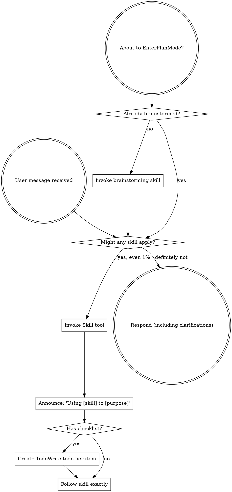

<EXTREMELY-IMPORTANT>
If you think there is even a 1% chance a skill might apply to what you are doing, you ABSOLUTELY MUST invoke the skill.

IF A SKILL APPLIES TO YOUR TASK, YOU DO NOT HAVE A CHOICE. YOU MUST USE IT.

This is not negotiable. This is not optional. You cannot rationalize your way out of this.
</EXTREMELY-IMPORTANT>

## How to Access Skills

**In Claude Code:** Use the `Skill` tool. When you invoke a skill, its content is loaded and presented to you—follow it directly. Never use the Read tool on skill files.

**In other environments:** Check your platform's documentation for how skills are loaded.

# Using Skills

## The Rule

**Invoke relevant or requested skills BEFORE any response or action.** Even a 1% chance a skill might apply means that you should invoke the skill to check. If an invoked skill turns out to be wrong for the situation, you don't need to use it.

## Red Flags

These thoughts mean STOP—you're rationalizing:

| Thought | Reality |
|---------|---------|
| "This is just a simple question" | Questions are tasks. Check for skills. |
| "I need more context first" | Skill check comes BEFORE clarifying questions. |
| "Let me explore the codebase first" | Skills tell you HOW to explore. Check first. |
| "I can check git/files quickly" | Files lack conversation context. Check for skills. |
| "Let me gather information first" | Skills tell you HOW to gather information. |
| "This doesn't need a formal skill" | If a skill exists, use it. |
| "I remember this skill" | Skills evolve. Read current version. |
| "This doesn't count as a task" | Action = task. Check for skills. |
| "The skill is overkill" | Simple things become complex. Use it. |
| "I'll just do this one thing first" | Check BEFORE doing anything. |
| "This feels productive" | Undisciplined action wastes time. Skills prevent this. |
| "I know what that means" | Knowing the concept ≠ using the skill. Invoke it. |

## Skill Catalog

Skills are organized into categories. Invoke by name using the `Skill` tool (e.g. `superpowers:summarizing`).

<!-- CATALOG_START -->
**thinking/** — Intellectual engagement
| Skill | Use when |
|-------|----------|
| `decision-making` | Facing a choice between concrete options and needing a rigorous, structured process to evaluate and commit. Invoke for any significant choice, even when the user just asks "which should I use?" or "what's better, X or Y? |
| `reasoning` | Facing a complex problem that needs structured thinking tools — first principles decomposition, pre-mortem analysis, assumption mapping, or inversion — to think more clearly before deciding or acting |
| `thinking-partner` | The user wants opinions, wants to brainstorm non-technical ideas, presents a claim to be challenged, or asks "what do you think". Invoke when the user seems to be wrestling with an idea, thinking out loud, or wants a genuine reaction rather than task execution. |

**qol/** — Output production
| Skill | Use when |
|-------|----------|
| `documenting` | Writing technical documentation — READMEs, API docs, architecture decision records, or CHANGELOG entries. Invoke whenever someone says "add a README", "write docs for this", "document this function", or "add a changelog entry". |
| `drafting` | The user wants to write a message, email, Slack post, announcement, or any communication — especially when they describe what they want to say but need it shaped into the right form, tone, or structure |
| `explaining` | The user asks to explain something, seems confused, or asks a "why" or "how does X work" question. Invoke whenever someone says "help me understand", "what is X", "break this down", or shows signs of not following a concept. |
| `grammar-mirror` | The user's message contains grammatical errors, awkward phrasing, or unclear sentence structure — especially when they appear to be a non-native speaker or write casually. Always show the corrected version of their input first, then answer. |
| `researching` | The user asks to research a topic, compare options, or investigate a claim. Invoke whenever comparing options, investigating a claim, or needing a synthesized answer the user can rely on — even if they don't say "research this". |
| `summarizing` | The user shares long content and wants key points, a tldr, or a condensed version. Invoke whenever content is shared that's longer than a person would want to read in full — meetings, threads, articles, PRs, docs. |

**meta/** — Skill system
| Skill | Use when |
|-------|----------|
| `md-improver` | Auditing, improving, or updating CLAUDE.md files — to keep project memory aligned with the actual codebase. Invoke when a CLAUDE.md might be stale, incomplete, or generic, or when the user asks to "audit the CLAUDE.md" or "check if CLAUDE.md is up to date". |
| `prompting` | Writing prompts, agent task descriptions, or skill instructions and they are getting long, repetitive, or unclear (efficiency mode), or when asked to generate a reusable prompt, system prompt, briefing document, or instruction set from scratch (generation mode). Invoke before sending any prompt to a subagent or external model, or when the user says "generate a prompt", "create a system prompt", or wants to export a workflow as reusable instructions. |
| `sensitive-data-guard` | Shared content may contain sensitive data — API keys, passwords, tokens, private keys, credentials, PII, or connection strings — before proceeding with any task involving that content |
| `session-memory` | Use proactively during a session to write searchable observations at natural pause points (after research, decisions, blockers, or topic switches), or when the user says "extract context" / "save progress" / "checkpoint" to save full session state, or when starting a session and wanting to restore state from a previous session. |
| `skill-management` | Creating a new skill, improving or testing an existing skill, or optimizing a skill's description for better triggering (creation phase), or when auditing the current skill system to evaluate quality, find overlaps, or plan improvements (stocktake phase). Invoke after adding 5+ new skills, after a major workflow change, or when a skill seems to fire in the wrong context. |
<!-- CATALOG_END -->

## Skill Priority

When multiple skills could apply:

1. **Process skills first** (brainstorming, debugging) — these determine HOW to approach the task
2. **Output skills second** (summarizing, drafting, explaining) — these guide what to produce

"Let's build X" → brainstorming first.
"Fix this bug" → systematic-debugging first.

## Skill Types

**Rigid** (TDD, debugging): Follow exactly. Don't adapt away discipline.

**Flexible** (patterns): Adapt principles to context.

The skill itself tells you which.

## User Instructions

Instructions say WHAT, not HOW. "Add X" or "Fix Y" doesn't mean skip workflows.
