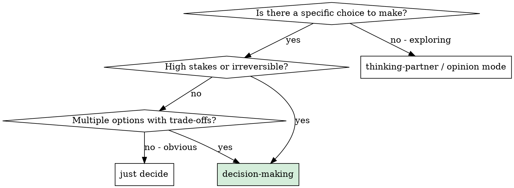

# Decision-Making

## Overview

Apply a structured framework to make decisions clearly, without rationalization, and with documented rationale.

**Core principle:** A good decision process produces a committed answer and a rationale — not a pros/cons list that leaves the decision to the reader.

---

## When to Use



**Use for:**
- Architecture decisions with long-term consequences
- Irreversible choices (vendor selection, data migration approach, public API design)
- Decisions where multiple options look roughly equivalent
- Any choice where "it depends" would be the answer without a framework

**Don't use for:**
- Obvious decisions — just make them
- Open exploration of ideas → `thinking-partner`
- Technical design brainstorm → `brainstorming`

---

## The Process

### Step 1: Classify the Decision

| Type | Characteristics | Implication |
|------|-----------------|-------------|
| **Reversible / low-stakes** | Easy to undo, limited blast radius | Decide fast, don't over-invest in analysis |
| **Reversible / high-stakes** | Can undo but it's costly | Structured analysis, document rationale |
| **Irreversible / low-stakes** | Can't undo, limited blast radius | Quick structured check, then commit |
| **Irreversible / high-stakes** | Can't undo, large blast radius | Full process — don't skip steps |

### Step 2: State the Decision Clearly

Write one sentence: "We are deciding [X]."

If you can't write that sentence, the decision isn't scoped yet. Ask: what specific question are we answering?

### Step 3: Enumerate Options

List all realistic options. Include:
- The obvious choice
- The contrarian choice
- The "do nothing" or "defer" option (always valid to name it)
- Any option the user mentioned even if it seems wrong

Don't evaluate yet. Just enumerate.

### Step 4: Define Criteria

List what matters for this decision. Weight each:
- **Must-have** — eliminates options that don't satisfy it
- **Important** — significant differentiator between options
- **Nice-to-have** — tie-breaker only

Common criteria: correctness, maintainability, performance, reversibility, team familiarity, time to implement, operational complexity.

### Step 5: Pre-Mortem

Before scoring: "Imagine it's 6 months from now and this decision turned out to be wrong. What went wrong?"

Run this for your top 2 options. What assumptions are you making that could fail?

### Step 6: Score and Recommend

For each option against each criterion:

```
Option A:
- Must-have 1: ✅ / ❌
- Important 1: ★★★ / ★★☆ / ★☆☆
- Important 2: ...
- Pre-mortem risk: [what could make this wrong]

Option B:
- ...
```

State a recommendation: "Option A. [One sentence primary reason]. [One sentence on the strongest counterargument and why it doesn't change the recommendation]."

### Step 7: Commit

A decision that isn't committed isn't a decision. State:
- What we decided
- What it means we WON'T do (ruling out alternatives is part of deciding)
- What the next action is

If the decision is significant, write it down: a comment, an ADR, a message to the team.

---

## On Disagreement

If you or the user disagrees with the recommendation:
1. Is this new evidence, or just discomfort with the commitment?
2. If new evidence: incorporate it and re-evaluate
3. If discomfort: acknowledge it, hold the recommendation, explain why

A decision revisited without new evidence is just delay.

---

## Common Failures

| Failure | What it looks like | Fix |
|---------|--------------------|-----|
| **Premature convergence** | Stopping at the first reasonable option | Enumerate all options before evaluating any |
| **Criteria drift** | Changing what matters based on which option looks better | Define criteria before scoring |
| **Analysis paralysis** | Gathering more information instead of deciding | Set a decision deadline; "good enough information" is enough |
| **False balance** | "Both options have merit" without a conclusion | Pick one. Document the trade-off. |
| **Revisiting without cause** | Re-opening decided questions due to discomfort | Ask: is there new evidence? If not, hold the decision. |

---

## Red Flags — You Haven't Actually Decided

- You wrote a pros/cons list and ended with "both are valid"
- You said "it depends" without then depending on something and concluding
- You can't state what you decided in one sentence
- You haven't named what you won't do
- You're still gathering information after a week
